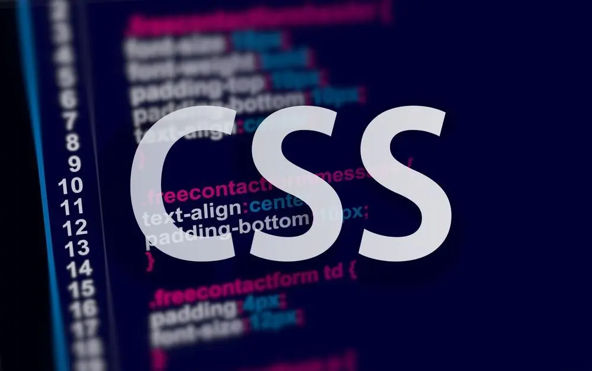

# CSS Practice Repository

<b>Welcome to the CSS Practice repository! This project is designed to help you improve your CSS skills through hands-on practice and examples.
Whether you're a beginner looking to learn the basics of CSS or an experienced developer wanting to refine your styling abilities, you'll find valuable resources here.</b>

